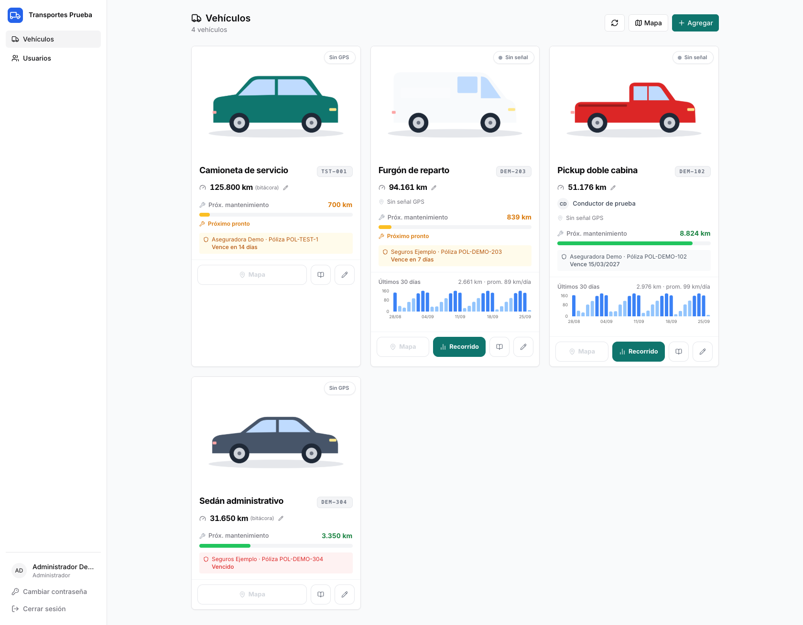
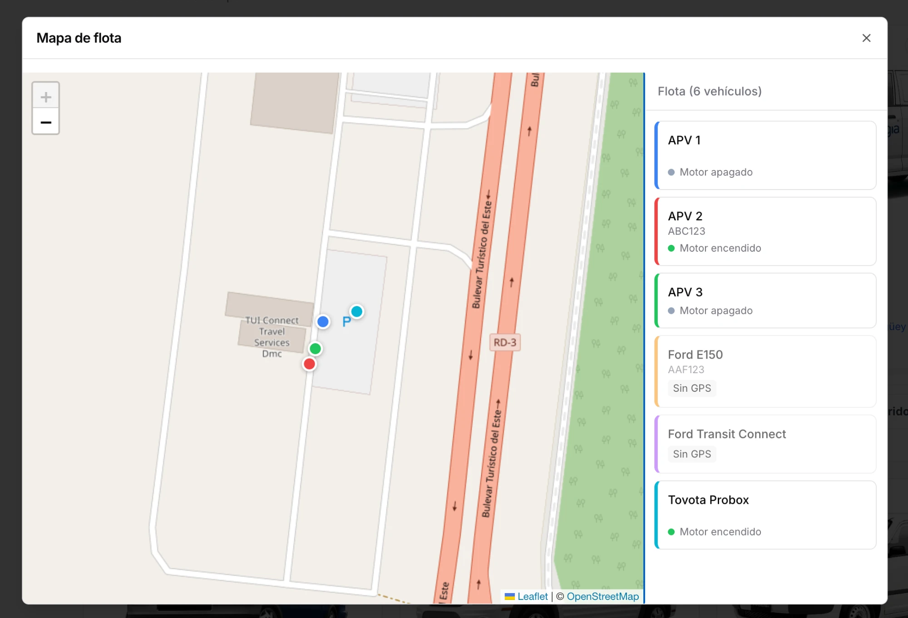
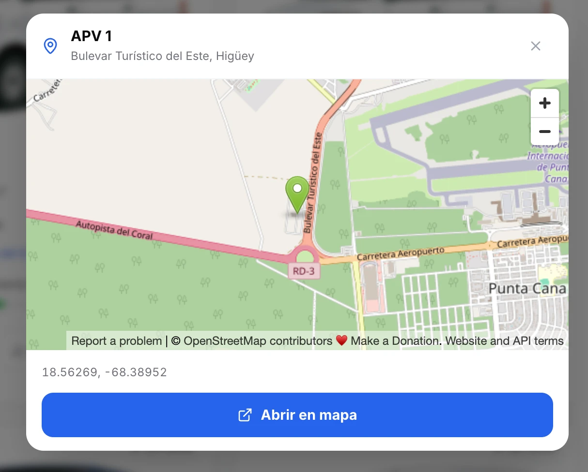
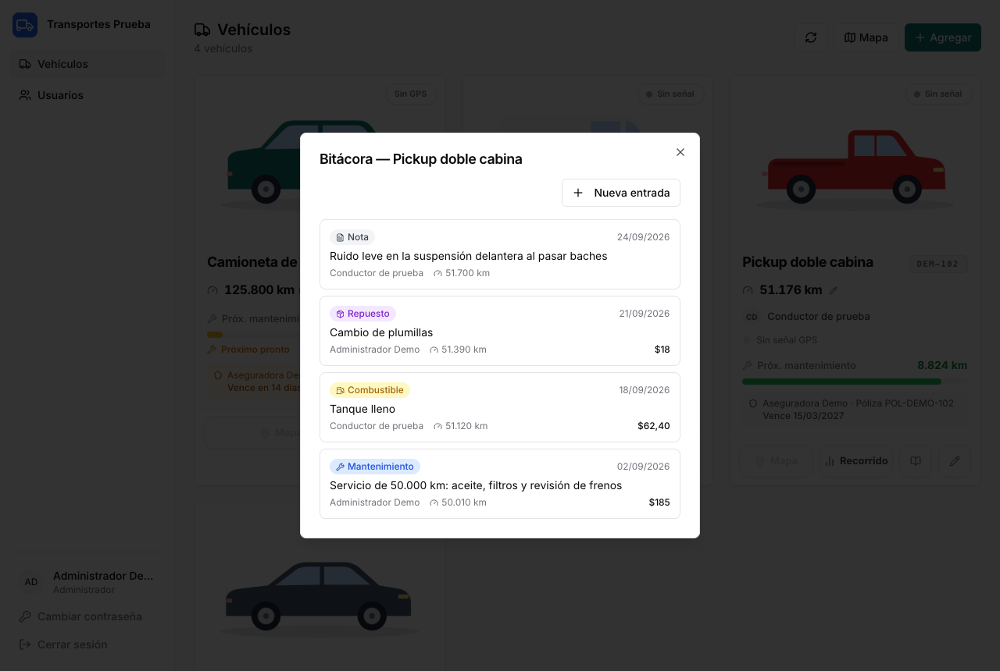
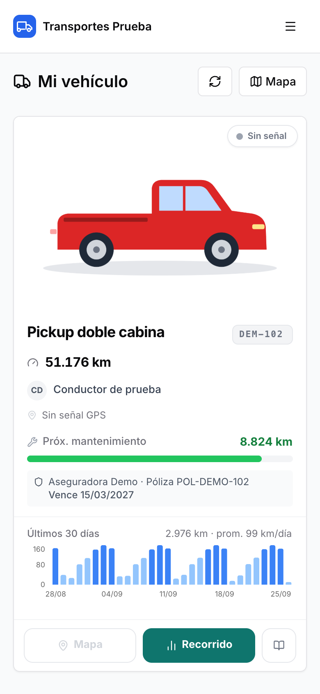

# Flota Admin

Plataforma web para administrar una flota de vehículos: kilometraje, mantenimiento, seguros, bitácora y ubicación por GPS. Cada empresa la instala en su propio servidor y con su propio proyecto de Supabase.

> Software propietario. Uso solo con autorización de Sinergia Networks SRL (ver [LICENSE](LICENSE)).



## Funcionalidades

- **Vehículos:** foto, placa, chasis, conductor asignado y notas. Los vehículos fuera de uso se **archivan**: dejan de aparecer (y de contar en GPS y correos), conservan su historial y se pueden restaurar.
- **Odómetro:**
  - con GPS: odómetro base + km diarios del GPS;
  - sin GPS: la última lectura registrada en la bitácora.
- **Mantenimiento:** próximo servicio por km y por fecha, con barra de progreso y alertas.
- **Seguro:** aseguradora, póliza, vencimiento (con alerta 30 días antes) y documento adjunto.
- **Correos a la flota:** alerta diaria cuando un mantenimiento (por km o por fecha) está por vencer, con los días estimados según el uso, y un reporte semanal con el estado de todos los vehículos. Destinatarios, umbrales y día del reporte se configuran desde la app.
- **Bitácora:** mantenimientos, reparaciones, repuestos, combustible y notas, con costo y kilometraje.
- **GPS (opcional):**
  - estado en vivo (en marcha, ralentí, motor apagado, sin señal);
  - dirección aproximada y mapa de toda la flota;
  - gráfica de km por día de los últimos 30 días.
- **Proveedores GPS intercambiables:** incluye Tracksolid Pro, y [agregar otro](docs/PROVEEDORES_GPS.md) es crear un archivo.
- **Roles:**
  - **Administrador:** gestiona todo.
  - **Conductor:** ve solo su vehículo, con los datos del seguro incluidos, y agrega entradas a la bitácora. Los permisos se aplican en la base de datos (RLS), no solo en la interfaz.
- **Marca configurable:** nombre, logo y color de la empresa.
- **Todo en español** y adaptado al teléfono.



| Ubicación de un vehículo | Bitácora | Vista del conductor (teléfono) |
|---|---|---|
|  |  |  |

## Arquitectura

```
┌──────────────────────┐        ┌──────────────── Supabase Cloud ────────────────┐
│ Navegador            │        │ Postgres + RLS    Auth     Storage (privado)   │
│ React + Vite         │ ─────► │ Edge functions: create-user · gps-status ·     │
│ (servido por Nginx   │        │                 sync-mileage ──► proveedor GPS │
│  en Docker)          │        │ pg_cron ──► sync-mileage (cada hora)           │
└──────────────────────┘        └────────────────────────────────────────────────┘
```

- **Frontend:** React 19, Vite, Tailwind y shadcn/ui, Leaflet y Recharts. Es una sola imagen Docker que sirve para cualquier instalación: la configuración se lee al arrancar el contenedor.
- **Backend:** Supabase (Postgres, Auth, Storage y Edge Functions en Deno). No hay servidor propio que mantener.

## Instalación

1. [**INSTALACION.md**](docs/INSTALACION.md): guía completa, del proyecto de Supabase al primer inicio de sesión.
2. [**DESPLIEGUE.md**](docs/DESPLIEGUE.md): el frontend con Docker, Docker Compose o Easypanel.
3. [**PROVEEDORES_GPS.md**](docs/PROVEEDORES_GPS.md): cómo funciona la integración GPS y cómo agregar un proveedor.
4. [**ACTUALIZACION.md**](docs/ACTUALIZACION.md): cómo actualizar una instalación existente.

## Desarrollo local

Crea `.env.local`, apuntando a un proyecto de Supabase de desarrollo con las migraciones aplicadas. En desarrollo las variables llevan el prefijo `VITE_`:

```
VITE_SUPABASE_URL=https://<ref-de-desarrollo>.supabase.co
VITE_SUPABASE_PUBLISHABLE_KEY=sb_publishable_...
VITE_APP_TIMEZONE=America/Mexico_City
```

```bash
npm install
npm run dev                   # http://localhost:5180
```

```bash
npm run lint
npm run build
```

Tests de las edge functions:

```bash
cd supabase/functions
npx -y deno test --allow-net --allow-env _tests/
```

## Estructura

```
src/                     Frontend (páginas, componentes, config de runtime)
docker/                  Nginx y generador de env-config.js
supabase/migrations/     Esquema, RLS, storage y cron
supabase/functions/      Edge functions y proveedores GPS (_shared/gps)
supabase/bootstrap/      SQL manual para el primer administrador
scripts/                 Script de alta del primer administrador
docs/                    Documentación
```
